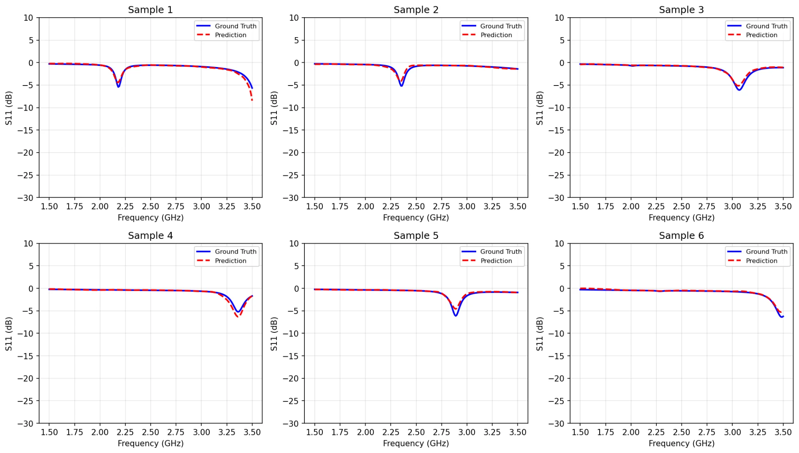
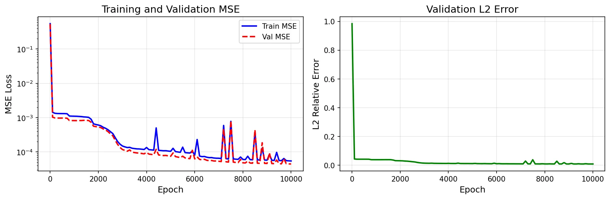
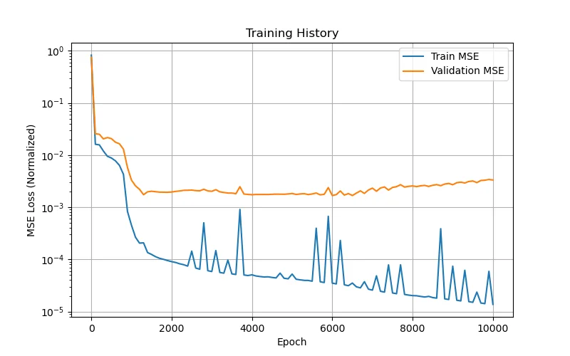

# Fusion DeepONet for Microstrip Patch Antenna S11 Prediction

[](https://www.python.org/downloads/)
[](https://github.com/google/jax)
[](https://opensource.org/licenses/MIT)

> **Honors Thesis**  
> Brown University — Applied Mathematics & Electrical Engineering  
> Advisor: Prof. George Karniadakis

## Overview

This repository implements a **Fusion DeepONet** architecture for learning the S11 frequency response of microstrip patch antennas as a function of geometry parameters. The model acts as a surrogate for full-wave electromagnetic simulations.

**Problem:** Given antenna geometry → Predict S11(f) across frequency sweep

$$S_{11}(\text{dB}) = \mathcal{G}_\theta(L, W, \text{inset}, \text{feedWidth}, h, \varepsilon_r; f)$$

## Key Results

| Dataset | Samples | Parameters | Test L2 Error | Test MAE |
|---------|---------|------------|---------------|----------|
| 2D Baseline | 36 | L, W | ~5% (overfits) | — |
| **6D Full** | **500** | L, W, inset, feedWidth, h, ε_r | **~1%** | **0.096 dB** |

### S11 Prediction Accuracy (6D Model)


### Training Convergence
| 6D Model (500 samples) | 2D Model (36 samples) |
|:----------------------:|:---------------------:|
|  |  |
| Good generalization | Overfitting (expected) |

## Repository Structure

```
antenna-deeponet/
├── data/
│   ├── raw/                          # Original data files
│   │   ├── dataset_wellmatched_raw_local.mat   # 500 samples, 6 params
│   │   └── antenna_geometries_36.csv           # 36 samples, 2 params
│   └── processed/                    # Preprocessed tensors (.npz)
├── src/
│   ├── models/
│   │   ├── train_6D.py              # 6-parameter training script
│   │   └── train_2D.py              # 2-parameter baseline
│   ├── preprocessing/
│   │   ├── preprocess_6D.py         # HDF5 .mat → .npz for 6D
│   │   └── preprocess_2D.py         # CSV → .npz for 2D
│   ├── optimization/
│   │   ├── inverse_design.py        # Find geometry for target S11
│   │   ├── monte_carlo_tolerance.py # Manufacturing yield analysis
│   │   └── sensitivity_analysis.py  # Parameter sensitivity study
│   └── utils/
│       └── visualization.py          # Result plotting
├── configs/                          # Hyperparameter configs
├── experiments/                      # Saved models & checkpoints
├── results/
│   ├── figures/                      # Training results
│   ├── inverse_design/               # Optimization results
│   ├── monte_carlo/                  # Tolerance analysis
│   └── sensitivity/                  # Sensitivity analysis
├── requirements.txt
└── README.md
```

## Quick Start

### 1. Setup Environment
```bash
git clone https://github.com/YOUR_USERNAME/antenna-deeponet.git
cd antenna-deeponet

python -m venv venv
source venv/bin/activate  # Windows: venv\Scripts\activate
pip install -r requirements.txt
```

### 2. Run 6D Pipeline (Main Results)
```bash
# Preprocess data
python src/preprocessing/preprocess_6D.py

# Train model (~30 min on CPU, ~5 min on GPU)
python src/models/train_6D.py

# Visualize results
python src/utils/visualization.py
```

### 3. Run 2D Baseline (Quick Test)
```bash
python src/preprocessing/preprocess_2D.py
python src/models/train_2D.py
```

## Optimization & Analysis Tools

Once trained, the surrogate model enables fast design exploration:

### Inverse Design
Find antenna geometry for a target frequency:
```bash
python src/optimization/inverse_design.py
```
- Gradient-based optimization using JAX autodiff
- Multi-start for global search
- Design for specific resonant frequency or bandwidth

### Monte Carlo Tolerance Analysis
Predict manufacturing yield:
```bash
python src/optimization/monte_carlo_tolerance.py
```
- Standard, precision, and low-cost PCB tolerances
- Yield prediction at different tolerance levels
- Identify critical parameters for quality control

### Sensitivity Analysis
Understand parameter effects:
```bash
python src/optimization/sensitivity_analysis.py
```
- One-at-a-time parameter sweeps
- Two-parameter interaction plots
- Global sensitivity rankings

## Method

### Fusion DeepONet Architecture

```
Geometry (L,W,h,...)  ──►  [Branch Network]  ──►  Latent b ∈ ℝ^64
                                                      │
                                                      ▼ (fusion)
Frequency (f)         ──►  [Trunk Network]   ──►  Latent t ∈ ℝ^64
                                                      │
                                                      ▼
                                               S11 = t · b
```

**Key Features:**
- **Adaptive activation:** `σ(z) = tanh(10az + c) + 10a₁sin(10F₁z + c₁)` with learnable parameters
- **Skip-connection fusion:** Branch features modulate trunk at each layer
- **Full-batch training:** Efficient for small-medium datasets

### Antenna Parameters

| Parameter | Symbol | Range | Unit |
|-----------|--------|-------|------|
| Patch Length | L | 22 - 48 | mm |
| Patch Width | W | 29 - 58 | mm |
| Inset Depth | inset | 8 - 17 | mm |
| Feed Width | feedWidth | 2 - 9 | mm |
| Substrate Height | h | 0.8 - 3.0 | mm |
| Relative Permittivity | ε_r | 2.2 - 3.5 | — |
| **Frequency** | f | 1.5 - 3.5 | GHz |

## Dependencies

```
jax>=0.4.0
jaxlib>=0.4.0
optax>=0.1.5
numpy>=1.21.0
scipy>=1.7.0
h5py>=3.0.0
matplotlib>=3.5.0
scikit-learn>=1.0.0
pandas>=1.3.0
```

## Citation

```bibtex
@thesis{YOUR_NAME_2025,
  author  = {Your Name},
  title   = {Fusion DeepONet for Electromagnetic Antenna Surrogate Modeling},
  school  = {Brown University},
  year    = {2025},
  type    = {Honors Thesis},
  note    = {Applied Mathematics and Electrical Engineering}
}
```

## References

1. Lu, L., Jin, P., Pang, G., Zhang, Z., & Karniadakis, G. E. (2021). Learning nonlinear operators via DeepONet. *Nature Machine Intelligence*, 3(3), 218-229.

2. Wang, S., Wang, H., & Perdikaris, P. (2021). Learning the solution operator of parametric PDEs with physics-informed DeepONets. *Science Advances*, 7(40).

## License

MIT License — see [LICENSE](LICENSE) for details.

## Acknowledgments

- Prof. George Karniadakis for thesis advising
- Brown University APMA and ECE departments
